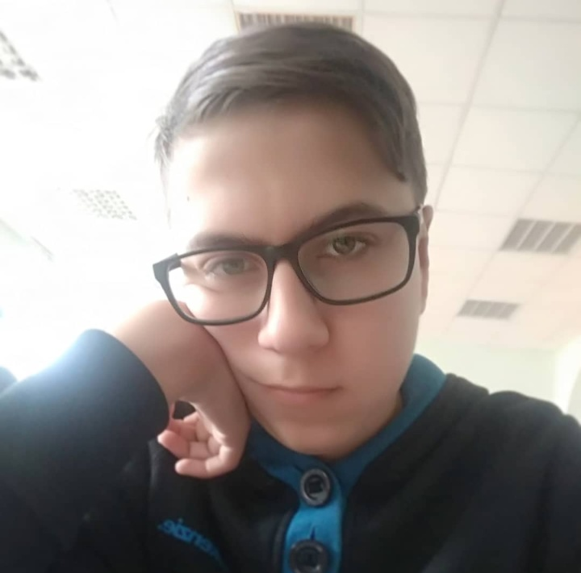

# Vladislav Mikulchik



## Contacts
GitHub: [@hardmandev](https://github.com/HardManDev) \
Email: <hardman.dev@protonmail.com>

## About me
Self-taught programmer for over 5 years. I want to find a job as a front-end developer or a back-end .NET developer. Read more hard skills section, it will tell you more.


## Hard skills
**Knowledge of OOP and SOLID principles;** \
Programming languages: **JavaScript(ES6+)/TypeScript, C#**, Java, Python, Lua; \
Markdown languages: **HTML, XAML, XML, CSS, SCSS, MD**; \
Frameworks: **React**, Vue, Express JS, Nest JS, .NET Framework, **.NET Core, EF Core 6**; \
VCS: **Git**; \
Methodologies: BEM; \
Tools: **Visual Studio Code**, Visual Studio, **JetBrains Rider, JetBrains Webstorm**; \
OS: **Windows, Linux (Ubuntu Desktop/Server, Arch linux);** \
Patterns: **Factory method, Builder, Dependency injection, Abstract factory, Mediator (specifically based on MediatR)**

> Bold font: Above average knowledge.


## Languages
- Russian (native)
- English (B1) - Level of reading/writing technical documentation.


## Education:
Minsk State College of Electronics: Computer operator (2017-2020)


## Projects
ASP.NET Project: [Contacts Manager](https://github.com/HardManDev/contacts-manager/tree/dev)


## Code example
```js
function topThreeWords(text) {
    let words = text.match(/[\w'-]+/gi)
    
    if (words && words[0] != '\'') {
        let top = []

        words = words.map(w => w.trim().toLowerCase())

        words.forEach(word1 => {
            if (top.some(w => w[0] == word1))
                return
            
            let count = 0
            words.forEach(word2 => {
                if (word1 === word2) count++
            });
            top.push([word1, count])
        });

        return top.sort((a, b) => b[1] - a[1]).slice(0, 3).map(e => e[0])
    }

    return []
}
```